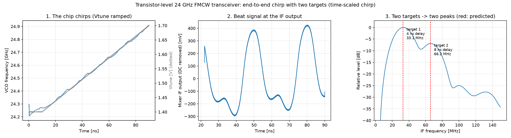
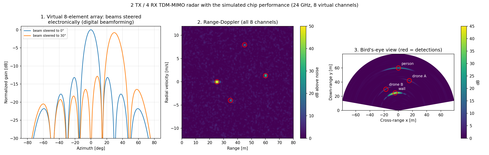
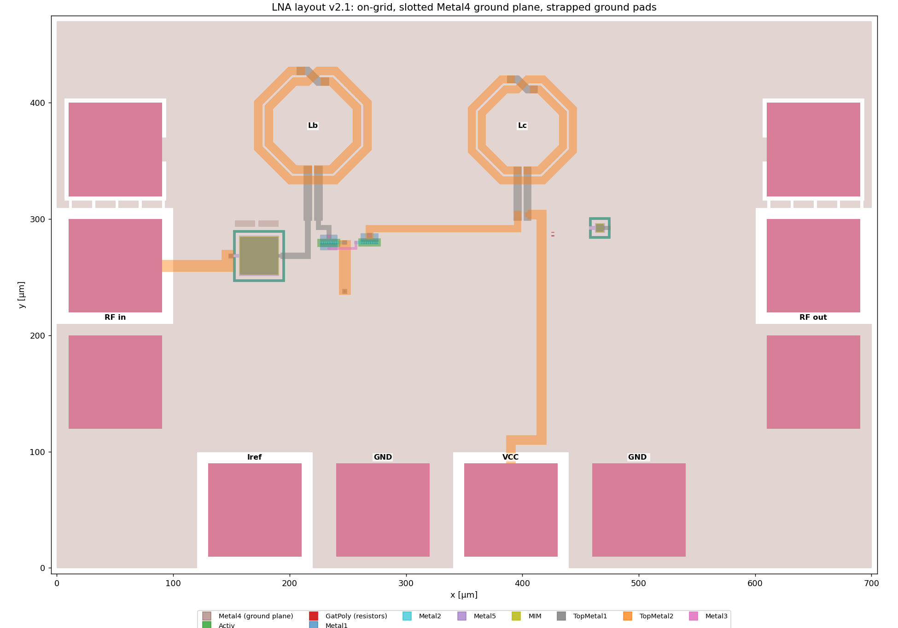

# 24 GHz FMCW Radar Transceiver Chip (IHP SG13G2 SiGe BiCMOS)

A transistor-level design of a **24 GHz FMCW radar transceiver** in the open-source
**IHP SG13G2** 130 nm SiGe BiCMOS process, targeting the 24.00–24.25 GHz ISM band:
VCO, LO buffer, power amplifier, LNA, mixer and ÷4 divider, integrated and simulated
together at the top level, plus a **2 TX / 4 RX TDM-MIMO** system model with digital
beamforming.

The full chip runs an **end-to-end chirp at transistor level**: the VCO sweeps, the PA
transmits, two simulated targets echo back, and the mixer output shows one beat tone per
target at exactly the predicted frequencies.



## System specifications (from `model/radar_system_model.py`)

| Parameter | Value |
|---|---|
| Band / waveform | 24.00–24.25 GHz, FMCW, 250 MHz bandwidth, 128 µs chirps |
| Range resolution | 0.60 m |
| Max velocity / velocity resolution | 24.3 m/s / 0.38 m/s |
| System noise figure (RX cascade) | 4.69 dB |
| EIRP | 15 dBm (regulatory target ≤ 20 dBm) |
| Detection range, small drone (0.01 m²) | 54 m (requirement ≥ 40 m) |
| Detection range, person (1 m²) | 171 m (requirement ≥ 100 m) |
| TX leakage margin to LNA compression | 10.3 dB |

All seven system requirements pass. The model is the single source of truth: change an
assumption in `CONFIG` and every derived number and requirement check updates.

## Architecture

```
            ┌──────────┐   ┌───────────┐   ┌──────┐
 Vtune ───► │   VCO    ├──►│ LO buffer ├──►│  PA  ├──► TX antenna (TX1 / TX2, TDM enable)
            └────┬─────┘   └─────┬─────┘   └──────┘
                 │               │ LO tree (4 matched outputs)
                 ▼               ▼
            ┌──────────┐   ┌───────────┐   ┌──────┐
 to PLL ◄───┤   ÷4     │   │   Mixer   │◄──┤ LNA  │◄── RX antenna (×4)
            └──────────┘   └─────┬─────┘   └──────┘
                                 ▼
                              IF out ──► ADC / FPGA (range-Doppler, CFAR, beamforming)
```

## Block results (transistor-level simulation, ngspice + IHP SG13G2 models)

| Block | Design | Key results |
|---|---|---|
| **VCO** | Cross-coupled LC with varactor tuning | 22.95–25.42 GHz tuning range, covers the band at all corners |
| **LNA** | HBT, current-mirror bias, EM-simulated inductors | ~20 dB gain, NF < 2.5 dB at 24 GHz, unconditionally stable from 1 to 100 GHz; **layout DRC-clean** (full IHP rule deck) |
| **Mixer** | Single-balanced | 7 dB conversion gain, IP1dB +3.1 dBm |
| **PA** | With TX enable for TDM-MIMO | ~5 dBm output; 71–79 dB on/off isolation across corners |
| **÷4 divider** | CML latches | Verified driven by the real VCO + LO buffer, at corners and VCC ±5% |
| **LO tree** | Distribution to 4 RX mixers | 10.3° rms phase mismatch (Monte Carlo, 60 virtual chips) |
| **Top level** | All six blocks together | TX + RX with TX leakage, passing at typical, fast −40 °C, slow 85 °C and slow 85 °C with VCC −5% |

## 2 TX / 4 RX TDM-MIMO system model

`model/mimo_scene.py` combines the simulated chip performance with an 8-element virtual
array, alternating TX chirps and an FPGA-style processing chain: range FFT → Doppler FFT
→ 2-D CA-CFAR → TDM Doppler compensation → angle estimation by beam scan. Running it with
`--phase-err 15` shows what uncalibrated LO phase errors do to the angle estimates.



## LNA layout

Generated by script (`lna/layout/lna_gen.py`) from IHP PCells using the EM-verified
netlist: slotted Metal4 ground plane, 5 nm grid snapping, and a full DRC pass with the
IHP SG13G2 rule deck.



## Repository layout

```
model/     system model (link budget, requirements) and 2TX/4RX MIMO scene
vco/       VCO and varactor characterization, LO buffer
lna/       HBT characterization, LNA design (stage1), EM-simulated inductors (em), layout + DRC (layout)
mixer/     single-balanced mixer
pa/        power amplifier, stability, TX enable
divider/   ÷4 divider (CML latch)
lotree/    LO distribution to the 4 RX mixers
top/       top-level integration, corner tests, end-to-end chirp demo
docs/      schematics
```

## Run it

```bash
# needs ngspice + the IHP SG13G2 PDK models, Python 3 with numpy and matplotlib
cd model && python3 radar_system_model.py      # link budget + requirement checks
cd top   && python3 run_top.py quick           # is the chip alive? (~30 s)
cd top   && python3 run_top.py corners         # full TX+RX test at all corners (~4 min)
cd top   && python3 run_chirp.py               # end-to-end chirp with two targets (~3 min)
```

## Status and next steps

- [x] System model and requirements
- [x] All six blocks designed and verified over corners (schematic level)
- [x] Top-level integration and end-to-end chirp demo
- [x] LNA layout, DRC-clean
- [ ] Layout of the remaining blocks, then full-chip LVS and parasitic extraction
- [ ] PCB with the 2 TX / 4 RX patch antenna array
- [ ] FPGA signal processing chain (range-Doppler, CFAR, beamforming)
